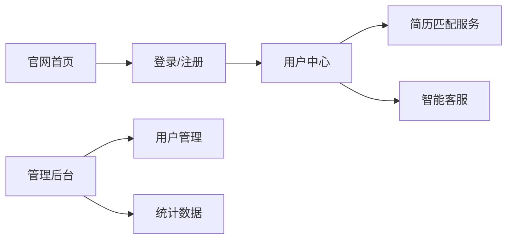

# 整体架构

## 技术栈

| 层级 | 技术 |
|------|------|
| 框架 | Nuxt 3 |
| 语言 | TypeScript / Vue 3 |
| 样式 | Vanilla CSS |
| 数据库 | SQLite + Prisma |
| 认证 | JWT + Cookie |

## 页面结构

```
pages/
├── index.vue          # 官网首页
├── login.vue          # 登录页
└── admin/
    ├── index.vue      # 管理后台主页
    └── login.vue      # 管理员登录
```

## 核心模块


