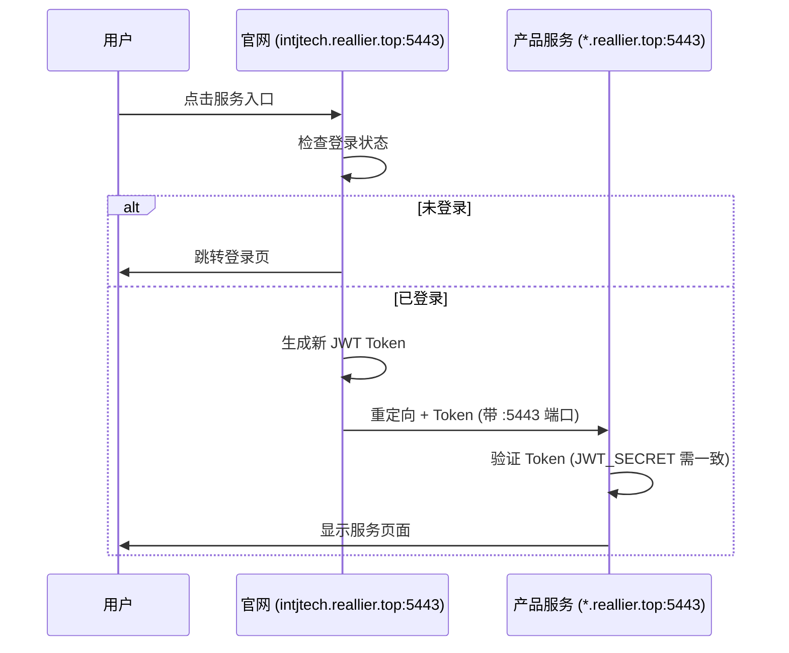

# 服务跳转模块

## 服务入口

官网作为统一入口，为各产品提供跳转服务。

> ⚠️ **重要**: 所有服务都通过 **5443 端口** 访问，不是标准 443 端口！

| 服务 | 入口 API | 跳转地址（完整） |
|------|------|----------|
| 简历匹配 | `/api/services/hirestream-redirect` | `https://app.reallier.top:5443` |
| MBTI判型 | `/api/services/mindai-redirect` | `https://mbti.reallier.top:5443` |
| 智能客服 | 直接链接 | `https://cs.reallier.top:5443` |

## 跳转流程



## 应用端认证要点

如果应用需要验证用户身份：

1. **使用相同的 JWT_SECRET**
   ```
   JWT_SECRET=5Sf4IrUfOLVQ7ul46zfg_w-bHHHu_Y67iqscKTw6UM0
   ```

2. **LOGIN_URL 必须包含 :5443 端口**
   ```
   LOGIN_URL=https://intjtech.reallier.top:5443/login?redirect=<app>
   ```

3. **支持两种 Token 来源**
   - URL Query Parameter: `?token=xxx`
   - Cookie: `auth_token`

## 相关文件

- `server/api/services/hirestream-redirect.get.ts`
- `server/api/services/mindai-redirect.get.ts`
- `pages/login.vue` - 登录页，处理 `redirect` 参数

## 环境变量

| 变量名 | 作用 | 示例值 |
|-------|------|--------|
| `HIRESTREAM_URL` | HireStream 跳转地址 | `https://app.reallier.top:5443` |
| `MINDAI_URL` | MindAI 跳转地址 | `https://mbti.reallier.top:5443` |
| `JWT_SECRET` | Token 签名密钥 | `5Sf4IrUfOLVQ7ul46zfg_w-...` |
