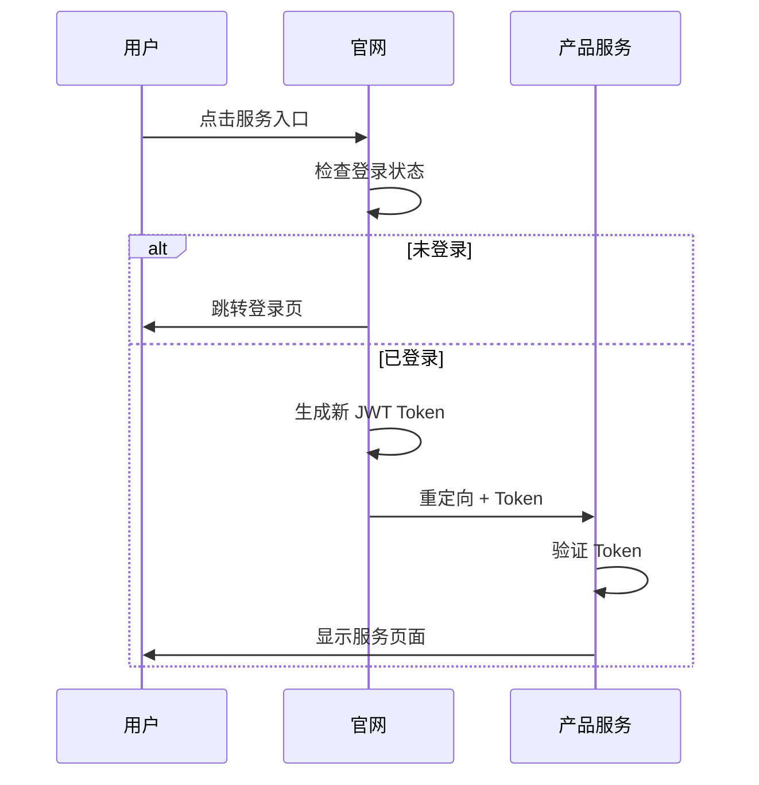

# 服务跳转模块

## 服务入口

官网作为统一入口，为各产品提供跳转服务。

| 服务 | 入口 | 跳转地址 |
|------|------|----------|
| 简历匹配 | `/api/services/hirestream-redirect` | `https://app.reallier.top` |
| 智能客服 | 🚧 待接入 | - |

## 跳转流程

## 相关文件

- `server/api/services/hirestream-redirect.get.ts`
